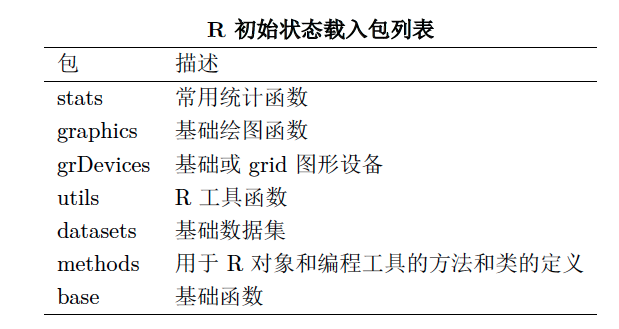
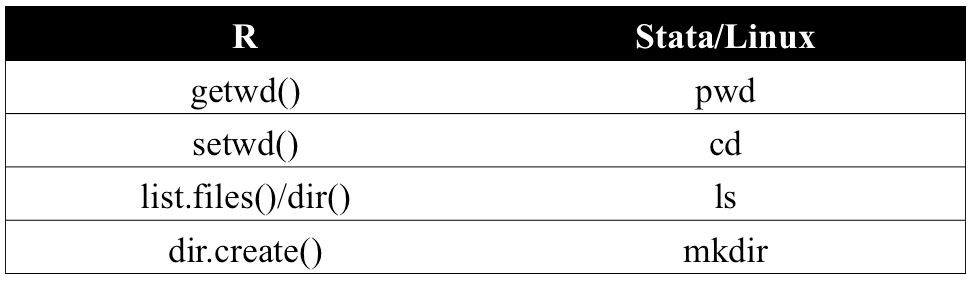

## Contents
>- 1. a brief introduction of R
>- 2. Installment and interface
>- 3. basics of R
>- 4. data class and structure
>- 5. data import and output

---

## R version 

>- version 3.3.1 (2016)
>- 32 bit / 64 bit (3.0) 
>- Microsoft R Open 3.3.1 (revolutionanalytics)

---

## Program installment

>- R website: http://www.r-project.org/
>- Microsoft R(Revolution Analytics):https://msdn.microsoft.com/en-us/microsoft-r/
>- Integrated Development Environment (IDE):Notepad++, Submile, Eclipse (StatET)...
>- Rstudio: http://www.rstudio.com/

---

## Rstudio settings
- menu:Tools-> Global options
- appearance (tomorrow night bright) 
- default directory (preference->default woring directory)
- default text encoding:utf-8
- svn/git (details about version control later)

```{r,eval=F}
Sys.getlocale()
Sys.setlocale(category = "LC_ALL", locale = "zh_cn.utf-8")
```

---


## Rstudio interface


---


## Rstudio interface

>- console: interactive 
>- source: shortcuts(ctrl+enter),cursor
>- Enviorment,history,presentation 
>- plot,packages

---

## Hello world!

```{r}
'Hello world!'
print('Hello world!')
cat ('Hello world!')
```


## help
```{r,eval=F}
 help('lm')    #"" can be omited,but not for +-*/
 ?lm
 example('lm') # "" can be omited
 apropos("mean") # "" can't be omited
 vignette("caret") #"" can't be omited
```

- English
- www.google.com
- http://stackoverflow.com/tags
- http://www.r-bloggers.com/

---

## packages
Packages are collections of R functions, data, and compiled code in a well-defined format.

- https://mirrors.ustc.edu.cn/CRAN/

---

## Workspace
```{r}
# library()
search() #loaded package
```


---


## Workspace
```{r,eval=F}
ls() #user-defined object
#up/down arrow: command history
getwd()
list.files()
# setwd("~/desktop") # special case for windows.
```

---

## file and folder

  

---

## packages installment

- search() .libPaths()
- install.packages() ## need "",with menu
- install.packages("packageName.tgz",repos = "http://cran.us.r-project.org/", type="source")
- system('R CMD INSTALL packageName.tgz')  ##local package
- install.packages("packageName.tgz",repos = NULL) ## local package
- install_github(repo =, username = ) library(devtools) #be cautious.

---

## packages loading/unloading
>- library(foreign); require(foreign)
>- detach(package:foreign)

>- bonus

```{r,eval=F}
if(!require(foreign)) install.packages('foreign')

```

---

## options

- options()
- options()$digits
- options(stringsAsFactors)

