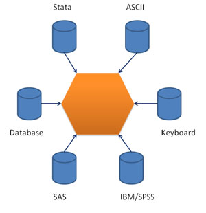

## Data import and export
                    
 

---

## Import and export

- text file
- excel file
- stata,spss
- online table
- databases

---

## Import text file

```{r, eval=FALSE}
str(read.table)
# write.table(iris,file='data/iris.txt',sep=','
#,quote=F,row.names=F)
#stringsAsFactors = F
iris_txt<-read.table("data/iris.txt",sep=",",header=T)
#stringsAsFactors = F
system.time(dat2 <- read.table("data/NYNEWYOR.txt", 
    col.names=c("DAY","MONTH","YEAR","TEMP")))

```

---

## Import excel file
```{r, eval=FALSE}
# library(xlsx)
# indicator_xls1<-read.xlsx("data/HIV.xlsx", 1)

# library(XLConnect)
# wb <- loadWorkbook("data/HIV.xlsx")
# indicator_xls2 <- readWorksheet(wb, sheet=1) 
rm(list=ls())
# detach(package:devtools)
# devtools::install_github("hadley/readxl")
library(readxl)
indicator_xls<-read_excel("data/HIV.xlsx", 1)
```


---

## import data from SPSS and Stata

```{r, eval=FALSE}
library(foreign)
Restaurant<-read.dta('data/Restaurant.dta')
head(Restaurant)
Restaurant_spss<-read.spss('data/restaurant.sav',
                      to.data.frame=TRUE)
head(Restaurant_spss)[1:5,]
#Restaurant<-read.ssd('restaurant.ssd',
                      #to.data.frame=TRUE)
```


---

## Online table
http://mirrors.ustc.edu.cn/CRAN/web/packages/
```{r,eval=F}
## example 1:packages
library(XML)
theURL=paste("http://mirrors.ustc.edu.cn/CRAN/web/packages/available_packages_by_date.html",
 sep="")
Rpackages = readHTMLTable(theURL, header=T,
          which=1,stringsAsFactors=F)
dim(Rpackages)
head(Rpackages)[1:4,1:3]
write.csv(Rpackages,'Rpackages.csv',sep='\t',1)

```

---

## Online table 2

```{r,warning=F,message=F}
library(XML)
URL="http://www.jaredlander.com/2015/03/teaching-r-in-asia-2/"
location = readHTMLTable(URL, header=T, 
                         which=2,stringsAsFactors=F)
head(location)[1:4,1:4]
```

---

## Databases: MySQL

 

---

## Databases: MySQL
```{r,warning=F}
# library(DBI);library(RMySQL)
# conn <- dbConnect(MySQL(),user='root',password='123456'
#                   ,host='localhost',dbname = "rmysql")
# users = dbGetQuery(conn, "SELECT * FROM f_demo")
# dbDisconnect(conn)
# head(users)
```

---

##  Export data
 
- text,csv,xlsx

```{r, eval=FALSE}
write.table(Restaurant,'output/Restaurant.txt',
            sep="\t",quote=F,row.name=F)
write.csv(Restaurant,'output/Restaurant.csv',
            row.names=F)
write.xlsx(Restaurant,'output/Restaurant.xlsx',
            row.name=F)
# writeWorksheetToFile('indicator.xlsx',
# data=df, sheet="FirstSheet")
```

---


## matlab and R: write data frame
```{r}
library(rmatio)
##write data frame
data<-data.frame(c(1,2,NA),c(4,5,6))
names(data)<-c('a','b')
data
write.mat(data, 'data/dataframe.mat')
```

---

## matlab: write list
```{r}
data2<-list(a=c(1:10),b=c(4,5,8))
data2
write.mat(data2, 'data/list.mat')
```

---

## matlab: write nested list.
```{r}
data(iris)
head(iris)[1,1:3]
names(iris)<-sub("\\.", "_", names(iris))
out<-split(iris[,c(1:4)],f=iris$Species)
write.mat(out,'data/iris_nested.mat')
```

---

##read mat file.
```{r}
read.mat('data/list.mat')
```

---
## Data import and export
                    
 

---
