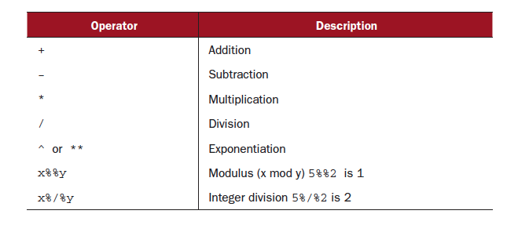
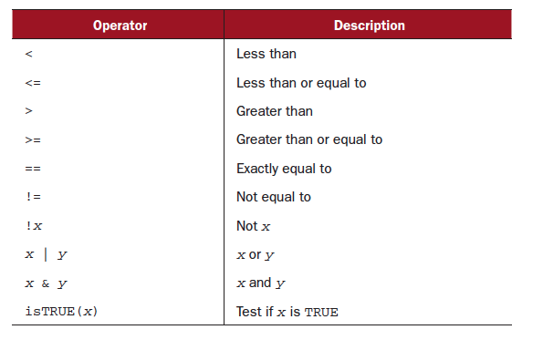

## Data arrangement

- basics of data arrangement
- apply

--- 

## Example

- gender different of leadership

```{r}
manager <- c(1, 2, 3, 4, 5)
date <- c("10/24/08", "10/28/08", "10/1/08", "10/12/08", "5/1/09")
gender <- c("M", "F", "F", "M", "F")
age <- c(32, 56, 25, 60, 99)
q1 <- c(5, 3, 3, 3, 2)
q2 <- c(4, 5, 5, 3, 2)
q3 <- c(5, 2, 5, 4, 1)
q4 <- c(5, 5, 5, NA, 2)
q5 <- c(5, 5, NA, 3, 1)
leadership <- data.frame(manager, date, gender, age,q1, q2, q3, q4, q5, stringsAsFactors = FALSE)
head(leadership)

```

---


## Creating new variables
```{r}
sum_q12<-(leadership$q1+leadership$q2)/2
sum_q12
leadership
```

---

## Arithmetic operators



---


##  Creating new variables continued

```{r}
attach(leadership)
leadership$sum_q12<-q1+q2
detach(leadership)
leadership

leadership_new<-transform(leadership,
                          sum_q12=(q1+q2),  ###not <-
                          mean_q12=(q1+q2)/2)
leadership_new
```

---
  
## Recoding variables

-   

---

## Recoding variables

```{r}
leadership$age[leadership$age == 99] <- NA
leadership
leadership$agecat[leadership$age > 75] <- "Elder"
leadership$agecat[leadership$age > 45 & 
                    leadership$age <= 75] <- "Middle Aged"
leadership$agecat[leadership$age <= 45] <- "Young"
leadership
```

---

## Recoding variables continued
```{r}
# compact version

leadership <- within(leadership, {
  agecat <- NA
  agecat[age > 75] <- "Elder"
  agecat[age >= 55 & age <= 75] <- "Middle Aged"
  agecat[age < 55] <- "Young"
})
leadership
```

---

## Rename
```{r}
names(leadership)[2]<- "testDate" #rename one varible
names(leadership)[5:9] <-c('aq1',"aq2","aq3","aq4","aq5") #rename several varibles
names(leadership)[names(leadership)=='gender']<-'Gender'
leadership
```

---

## Rename continued
-- reshape
```{r}
if (!(require(reshape))) install.packages("reshape") 
library(reshape)
leadership
rename(leadership, c(manager = "managerID", date = "testDate"))
```

---

## Missing data: NA

```{r}
mean(leadership$aq4)
mean(leadership$aq4,na.rm=T)
na.omit(leadership)
leadership
leadership[which(leadership$aq4!=NA),]
leadership[!is.na(leadership$aq4),]
```

---

## Format convert

```{r}
leadership$age <- as.numeric(leadership$age)
is.numeric(leadership$age)
leadership$age <- as.character(leadership$age)
is.character(leadership$age)
leadership$age <- as.numeric(leadership$age)
is.numeric(leadership$age)
```

---

## missing data
```{r}
value<-c(5,5,6,7,5,NA,3,5)
value==5
value!=5
```


```{r}
a <- c(1,2,2,5,1,NA,0,2)
b <- c(1,NA,4,7,1,NA,-1,2)
d <- c(1,1,NA,6,1,NA,1,2)
k<-data.frame(a,b,d)
logic<-sapply(k,is.na)
k$e<-rowSums(!logic)


k$value<-rowSums(k[,c('a','b','d')],na.rm=T)
k$value[k$e==0]<-NA
k
```


## Sort data

```{r}
attach(leadership)
newdata <- leadership[order(age), ]
newdata
detach(leadership)
attach(leadership)
newdata <- leadership[order(gender, -age), ]### blank on the right side.
newdata
detach(leadership)
```

---

## Select variables
```{r}
newdata <- leadership[, c(5:9)]  #blank on the left side for variables selection
newdata
myvars <- c("aq1", "aq2", "aq3", "aq4", "aq5")
newdata <- leadership[myvars]
newdata
myvars <- paste("aq", 1:5, sep = "")
myvars
newdata <- leadership[myvars]
```

---

## Drop variables
```{r}
newdata <- leadership[,c(-7, -8)]
newdata
newdata <- leadership[c(-7, -9)]
newdata <- leadership[,c(-7:-9)]

leadership[,-13]
leadership$season<-NULL
leadership

myvars <- names(leadership) %in% c("aq3", "aq4")
myvars
newdata <- leadership[!myvars]
```

---

## Select Observations
```{r}
newdata <- leadership[1:3, ]
newdata <- leadership[which(leadership$gender == "M" & 
                              leadership$age > 30), ]
attach(leadership)
newdata <- leadership[gender == "M" & age > 30, ]
newdata <- leadership[which(gender == "M" & age > 30), ]
###blank on the right side for the observation selection
detach(leadership)
```

---

## Subset with subset() function
```{r}

newdata <- subset(leadership, age >= 35 | age < 24, c(aq1, aq2, aq3, aq4))
newdata <- subset(leadership, gender == "M" & age > 25, select = Gender:aq4)
newdata <- subset(leadership, rownames=1:3, select = Gender:aq4)
```

---

## Using SQL statements to manipulate data frames
```{r}
if(!require(sqldf)) install.packages('sqldf')
newdf <- sqldf("select * from mtcars where carb=1 order by mpg", 
               row.names = TRUE)
newdf
newdf <- sqldf("select avg(mpg) as avg_mpg, avg(disp) as avg_disp,
    gear from mtcars where cyl in (4, 6) group by gear")
newdf

