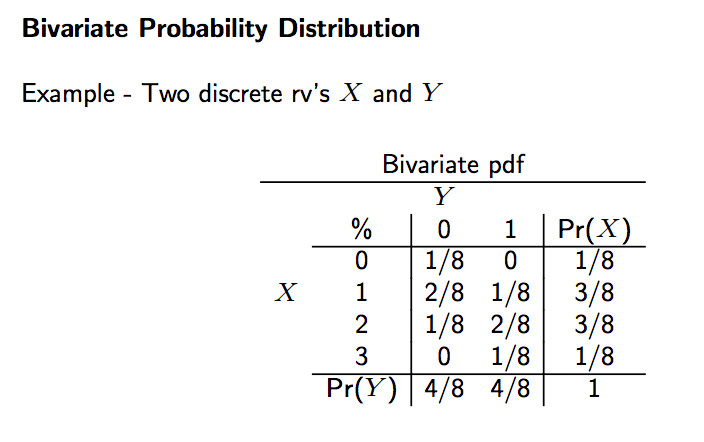
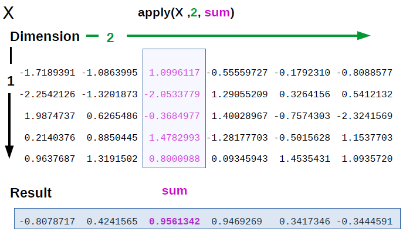
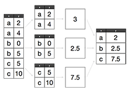
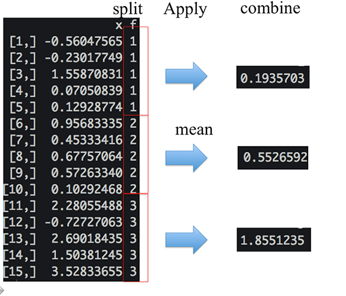

## vectorization

- R user vs. R programmer/developer
- Vectorization is the more limited process of converting a computer program
from a scalar implementation, which processes a single pair of operands at
a time, to a vector implementation which processes one operation on multiple
pairs of operands at once.

- Vectorization is a particular form of how parallelism is achieved.

---

```{r setup, include=FALSE}
options(digits=2)
```

---  
## examples of vectorization
- vector extraction: V[1:10] 
- vector assignment: V[1:10] <- seq(1,10) 
- apply:sapply(V, mean) 
- vector/matrix: A +/- B; A %*% B  

---

## vectorization

- apply family
- plyr/reshape
- dplyr/data.table

---

## Looping on the Command Line
- `apply`: Apply a function over the margins of an array
- `lapply`: Loop over a list and evaluate a function on each element 
- `sapply`: Same as `lapply` but try to simplify the result
- `tapply`: Apply a function over subsets of a vector
- `mapply`: Multivariate version of lapply

 `split` is also useful, especially in conjunction with `lapply`.

---

## apply
- what does apply mean.
- apply to different dimension.
- compare with rowMeans etc.
- different functions.

---
  
## apply

  `apply` is used to evaluate a function (often an anonymous one) over the **margins** of an array.
  
-  used to apply a function to the rows or columns of a matrix or an array.
-  used with general arrays, e.g. taking the average, standard deviation.
-  not really faster than writing a loop, but make it simpler.

---

## apply: margin


  
## apply 
  
```{r}
str(apply)
```

- `X` is an array
- `MARGIN` is an integer vector indicating which margins should be “retained”. 
- `FUN` is a function to be applied
- `...` is for **other arguments** to be passed to `FUN`

---

## apply a function to the rows or columns of a matrix.


```{r,echo=F}
# matrix(rnorm(30),6,5)
```

---

## apply vs. standard method
```{r,eval=F}
y<-matrix(rnorm(6),2,3)
y
cbind(mean(y[1,]),mean(y[2,]))
apply(y,1,mean)


x <- matrix(rnorm(30), 5, 6)
sumx<-NULL
for (i in 1:6){
temp<-sum(x[,i])
sumx[i]<-temp
}
sumx
apply(x,2,sum)
```

---

## col/row sums and means

- For sums and means of matrix dimensions, we have some shortcuts.
- rowSums(x) 
- rowMeans(x)
- colSums(x)
- colMeans(x)

---
## Efficiency
```{r,eval=F}
x <- matrix(rnorm(10^8), nrow=10^6)
dim(x)
system.time(y1 <- apply(x, 2, sum))
length(y1)
system.time(y2 <- colSums(x))
identical(y1, y2)
```
>- Faster than apply.

---

## apply with ...

```{r,eval=F} 
x <- matrix(rnorm(200), 20, 10)
dim(x)
apply(x, 2, quantile)
apply(x, 2, quantile, probs = c(0.25, 0.75))
```

---

## `lapply` :start from an example
`lapply` Loop over a list and evaluate a function on each element
```{r,eval=F}
##user-defined function.
  func<-function(x){
    if (x%%2 == 0) {
      ret<-'even'
    }else{
      ret<-'odd'}
    return(ret)
  }

func(101)
vec<-round(runif(4)*100)
vec
vec;func(vec)
lapply(vec,func)
```

---

## vectorization.
```{r,eval=F}
func<-Vectorize(func)
func(vec)
# ifelse(vec%%2,'even','odd')
```

---

## lapply
`lapply` takes three arguments:
```{r}
str(lapply)
```

---

## lapply: beyond apply. 
`lapply` always returns a list, regardless of the input.
```{r,eval=F}
lapply(iris[,1:4],mean)
```

---

## lapply 
```{r,eval=F}
x <- list(a = 1:5, b = rnorm(10))
x;lapply(x, mean)
```

---
## lapply: function  
```{r,eval=F}
x <- 1:4
lapply(x, runif)
```

---
## lapply  `...`
```{r}
x <- 1:4
lapply(x, runif, min = 0, max = 10)
```

---
## data and missing.
```{r,eval=F}
data(iris)
iris
iris[3,c(2,4)]<-NA
lapply(iris[,1:4],mean,na.rm=T)
```

---

## lapply
make use of _anonymous_ functions for `lapply`.
example: An anonymous function for extracting the 1st row of each matrix.

```{r,eval=F}
data <- list(a = matrix(1:6, 2, 3), b = matrix(1:6, 3, 2), c =matrix(10:15,3,2)) 
data
lapply(data, function(x) x[1,])
```

---

## lapply 
_anonymous_ functions continued.

```{r,eval=F}
lapply(iris[,1:4],function(x) sd(x,na.rm=T)/mean(x,na.rm=T))
myfunc<-function(x){
  rec<-c(mean(x,na.rm=T),sd(x,na.rm=T))
  return(rec)
}
result<-lapply(iris[,1:4],myfunc)
result
```

---

## methods to covert list into data.frame.

```{r,eval=F}
t(as.data.frame(result))
# t(sapply(result,'['))
do.call('rbind',result)
```

---
  
## sapply
  `sapply` will try to simplify the result of `lapply` if possible.

- If the result is a list where every element is length 1, then a vector is returned
- If the result is a list where every element is a vector of the same length (> 1), a matrix is returned.
- If it can’t figure things out, a list is returned

--- 
## sapply
```{r}
x <- list(a = 1:4, b = rnorm(10), c = rnorm(20, 1), d = rnorm(100, 5))
lapply(x, mean)
sapply(x, mean) 
# mean(x)
```

---


##  tapply: split-apply-combine.  
- Split up a big dataset
- Apply a function to each piece
- Combine all the pieces back together
- map-reduce in hadoop.  
  


---


## tapply
`tapply` is used to apply a function over subsets of a vector.
- apply, sapply/lapply vs. tapply
```{r}
str(tapply)
```

---

## tapply
Take group means.


---

## tapply
```{r}
set.seed(123)
 x <- c(rnorm(5), runif(5), rnorm(5, 1))
 f <- gl(3, 5)
 data<-cbind(x,f)
 tapply(x, f, mean)
 tapply(x, f, mean, simplify = FALSE)
```

---
  
## tapply
Find group ranges.

```{r}
tapply(x, f, range)
```

---

## tapply example

- iris flower dataset:Stata,python,R
- <https://en.wikipedia.org/wiki/Iris_flower_data_set>


---

## tapply example


---

## tapply example
- vs. pivot table in excel
```{r}
str(iris)
head(iris)
```

---


## tapply example

- vs. pivot table in excel
```{r}
tapply(iris[,1], iris$Species, mean)
t(sapply(iris[,1:4],function(x) tapply(x, iris$Species, mean,na.rm=T)))
# myfun<-function(x) {
#   tapply(x, iris$Species, mean,na.rm=T)
# }
# sapply(iris[,1:3],myfun)
```

---

## split
  `split` takes a vector or other objects and splits it into groups determined by a factor or list of factors.

```{r}
str(split)
# function (x, f, drop = FALSE, ...)
```

- `x` is a vector (or list) or data frame
- `f` is a factor (or coerced to one) or a list of factors
- `drop` indicates whether empty factors levels should be dropped

---
  
## split
  
```{r}
x <- c(rnorm(10), runif(10), rnorm(10, 1))
f <- gl(3, 10)
split(x, f)
```

---
  
## split
A common idiom is `split` followed by an `lapply`.

```{r}
lapply(split(x, f), mean)
```

---

## Splitting on More than One Level  
```{r}
x <- rnorm(10)
f1 <- gl(2, 5)
f2 <- gl(5, 2)
f1;f2
interaction(f1, f2)
data<-cbind(x,f1,f2)
data
```

---  
## Splitting on More than One Level
Interactions can create empty levels.

```{r}
split(x, list(f1, f2))
```

---
## split:Empty levels can be dropped.

```{r}
str(split(x, list(f1, f2), drop = TRUE))
```

---

  
## Splitting a Data Frame
```{r}
s <- split(iris, iris$Species)
# str(s)
sapply(s, function(x) colMeans(x[, 1:4],na.rm=T))
# sapply(s, function(x) sapply((x[, 1:4]), mean,na.rm=T))
```

---

## mapply
lapply and sapply only iterate over a single R object.
```{r}
str(lapply)
str(mapply)
```


## mapply
lapply and sapply only iterate over a single R object.
```{r}
## list(rep(1, 4), rep(2, 3), rep(3, 2), rep(4, 1))
mapply(rep,1:4,4:1)
```

---

## mapply
lapply and sapply only iterate over a single R object.
```{r}
## list(rep(1, 4), rep(2, 3), rep(3, 2), rep(4, 1))
mapply(rep,1:4,4:1)
```

---

## mapply

```{r,eval=F}
noise <- function(n, mean, sd) {
 rnorm(n, mean, sd)
 }
noise(5,1,2)
noise(100, 1:20, 5:1)
##revisit this when we talk about Sprintf function later. 
simulation<-mapply(noise,100000,1:20,5:1)
dim(simulation)
apply(simulation,2,mean)
apply(simulation,2,sd)
```

---

## mapply
```{r,eval=F}
##1. generate dataset called data
data<-data.frame(a<-c(1:5),b<-c(2:6),d<-c(3:7),
                 e<-c('1','2','a','x','y'),
                 f<-c('2','3','5','d','c'),
                 g<-c('3','k','5','6',NA),
                 stringsAsFactors = F)
data[,1:3]<-sapply(data[,1:3],as.character)
names(data)<-letters[1:6]
##2. do mapply
myfunc<-function(x, y) {
  ifelse(grepl('[a-z]',y), y, x)
}
data2<-data
data2[1:3] = mapply(myfunc, data[1:3], data[4:6])
data2
```

---

## Looping on the Command Line

- `lapply`: Loop over a list and evaluate a function on each element 
- `sapply`: Same as `lapply` but try to simplify the result
- `apply`: Apply a function over the margins of an array
- `tapply`: Apply a function over subsets of a vector
- `mapply`: Multivariate version of lapply