## Reproducible workshop

- thinking
- discussion
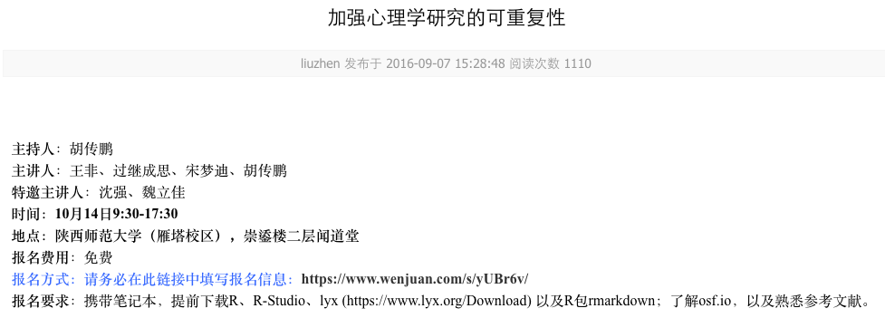

---


## problem

- Run analysis and get the result
- copy paste it into a file and write up the report.

 There is no single document to integrate data analysis with textual representations; i.e. data, code, and text are not linked.

## problem

- error-prone due to manual work
- tedious jobs to copy and paste
- Graphical User Interface is not recordable
- Tiny change need to redo the whole procedure.
- Communication cost is high for collaboration

---

## reproducible research

>- Reproducibile property of research conclusion
>- reproducibility of your own work.

---

## reproducible research

Estimating the reproducibility of psychological science
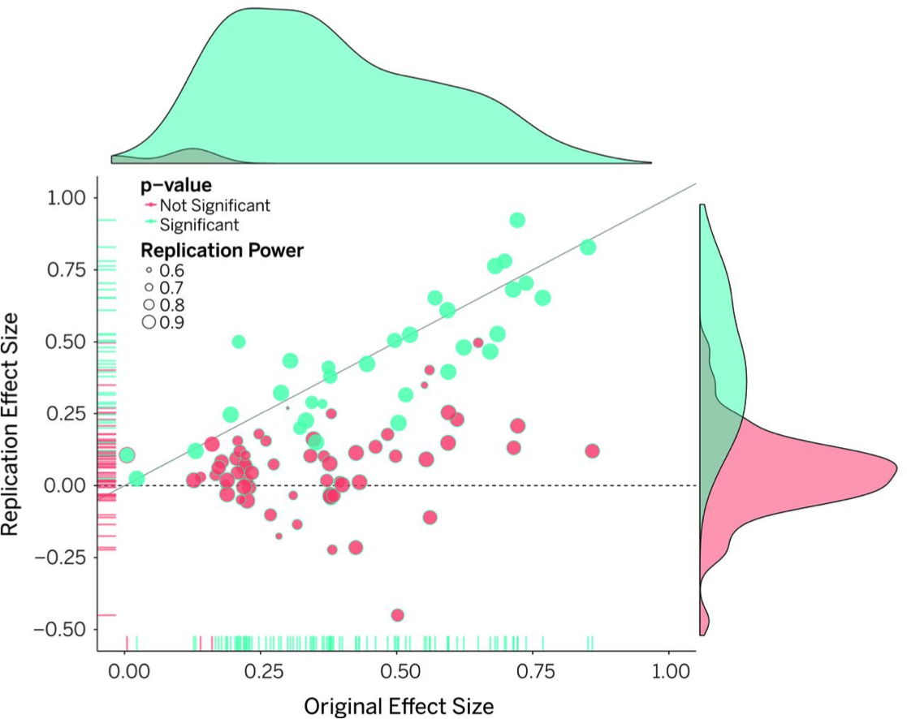

---

## literate cons 

- Text and code all can make documents difficult to read.
- Can substantially slow down processing of documents.

---

## How Do I Make My Work Reproducible?

- version control
- literate programming

---

## Version control

Start from a real scenario: daily tasks

- **Create** things
- **Save** things
- **Edit** things
- Save the thing **again**

---

## Start from a real scenario

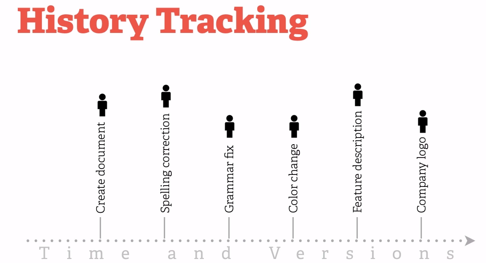

---


## Start from a real scenario

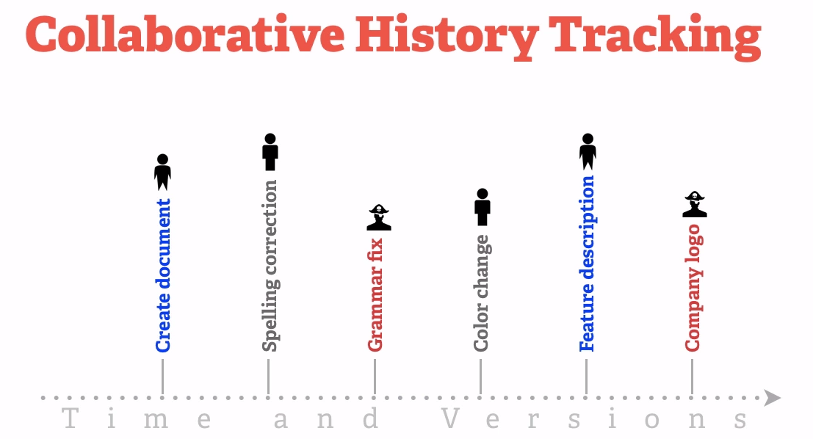

---

## Version control is important!


## Clound storage
- Dropbox
- Nutstore


## Git


## Github

- a web-based Git repository hosting service


---

## Prerequsites:
- Basic knowledge of R 
- Working knowledge of RStudio 
- Basic knowledge of command shell 
- Curiosity to explore new stuff!

---


## Literate programming
-  conceived by Donald Knuth (Knuth,1984)
-  mix the source code and documentation together
-  code is divided into text and code “chunks”.
-  **weaved** to produce documents and **tangled** to get source code

---


## Literate programming

1. itself is only a concept or idea.
- A documentation language
- A programming language
2. S**weave** system (Friedrich Leisch) used LaTeX and R
3. **knit**r supports a variety of documentation languages

---


## reproducible programming in Rstudio

- Sweave (rstudio->preference->Sweave)
- knitr


---


## Knitr
- An R package written by Yihui Xie 
- Supports  **LaTeX**, **RMarkdown**,and HTML as documentation languages
Can export to, do PDF, HTML
- Built right into RStudio for your convenience.

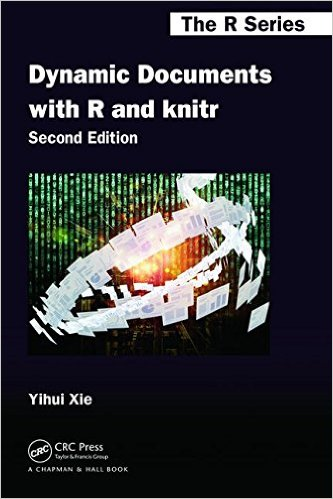

---


## Knitr

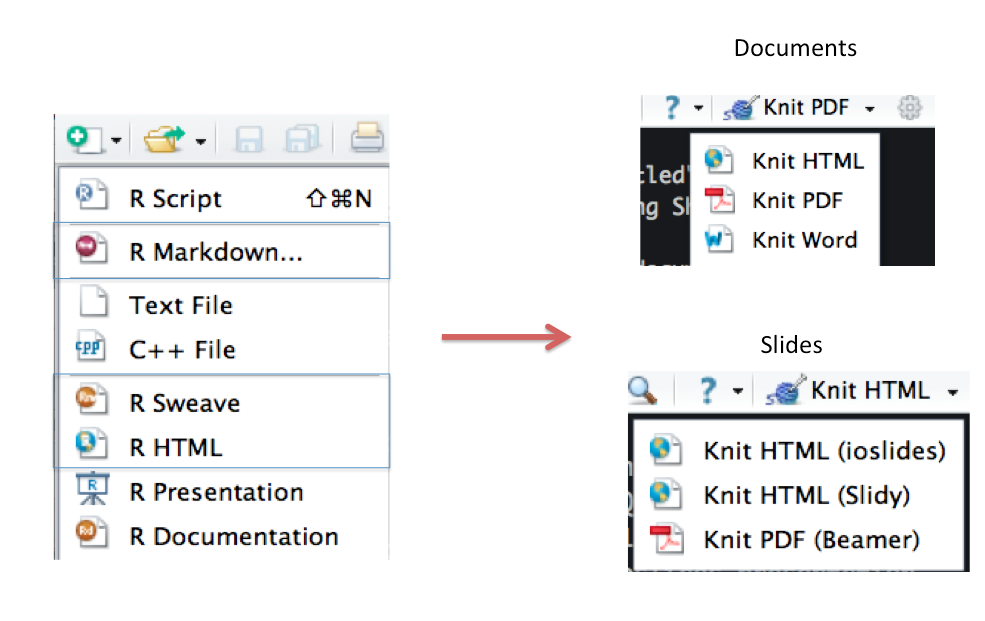

---

## weave/knit in Rstudio 

- Latex
- markdown

---

## framework
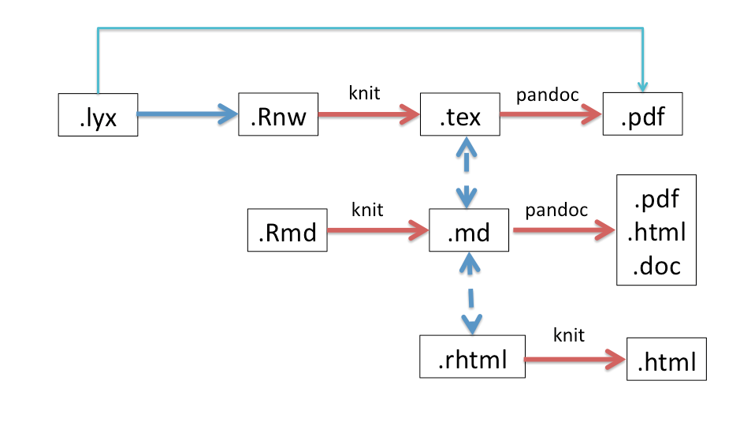

---

## Latex

1. MiKTEX (Windows: http://miktex.org/),
2. MacTEX (BasicTeX) (Mac OS: http://tug.org/mactex/),
3. TEXLive (Linux: http://tug.org/texlive/).
- WYSIWYM: Document Processing
- WYSIWYG: Word Processing
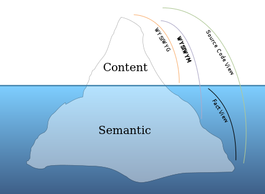

---


## Latex

.Rnw in Rstudio

- example-1.Rnw
- example-1-knitr.Rnw
- knitr-minimal.Rnw

http://tobi.oetik-er.ch/lshort/lshort.pdf


---


## lyx

- lyx:https://www.lyx.org/
- compatible with knitr after LyX 2.0.3.

combines the power and flexibility of TeX/LaTeX with the ease of use of a graphical interface.

---

## lyx 

- knitr-minimal.lyx
- knitr.lyx


---

## Latex/lyx
R code in .Rnw
  - chunks  
  - inline 

```{r,eval=F}
##chunk
<<>>=
set.seed(1121)
(x=rnorm(20))
mean(x);var(x)
@
##inline
\Sexpr{pi}
```

---

## lyx: table output
```{r,eval=F}
<<xtable, results="asis">>=
n <- 100
x <- rnorm(n)
y <- 2*x + rnorm(n)
out <- lm(y ~ x)
library(xtable)
xtable(summary(out)$coef, digits=c(0, 2, 2, 1, 2))
@
```

---


## Latex/lyx


```{r,results='asis',message=FALSE}
result<-summary(with(mtcars,lm(mpg~hp+wt)))
library(knitr)
kable(result$coe)
```

---


## What is markdown

- A simplified version of “markup” languages
- No special editor required
- Simple, intuitive formatting elements

---

## markdown in R: rmarkdown

1. markdown
   
   markdown_example.md
2. R code
  - chunks  
  - inline 
  
  demo.Rmd
  figure.Rmd
  
---

## markdown in Rstudio
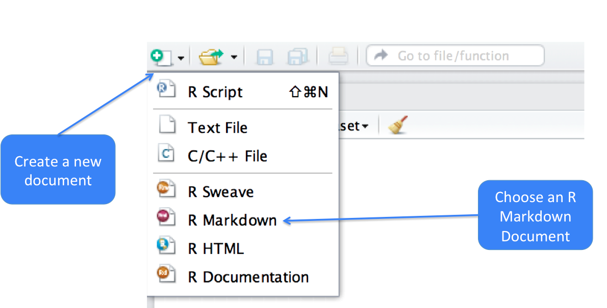

---

## markdown in Rstudio


---

## markdown in Rstudio
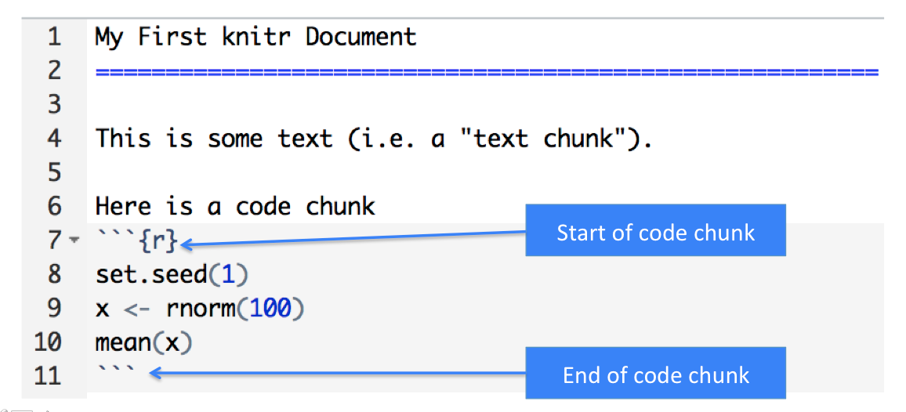

---

## markdown in Rstudio
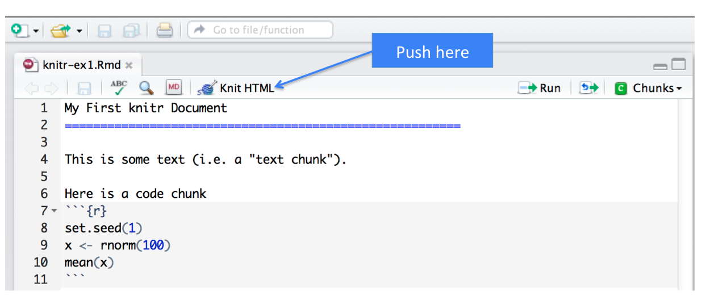

---

## markdown in Rstudio
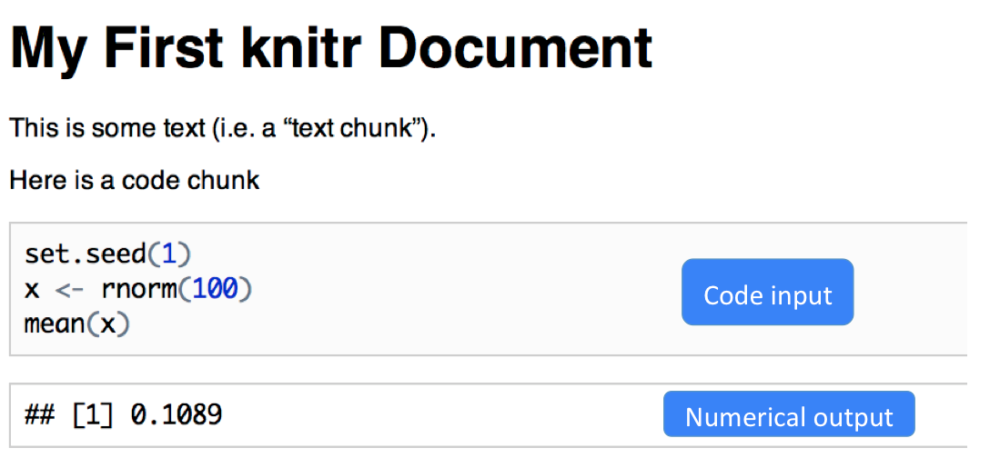

---

## markdown in Rstudio
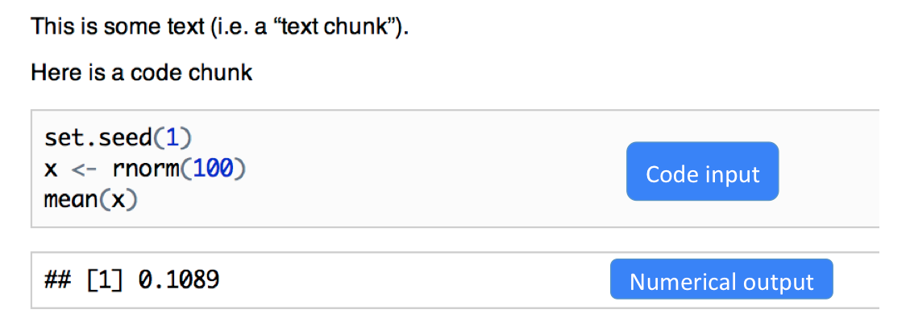

---

## markdown in Rstudio
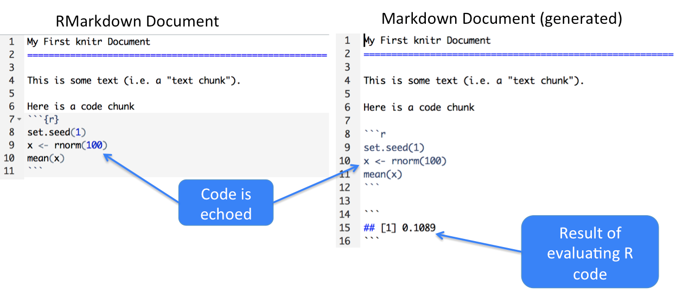

---

## options

- options
- global options
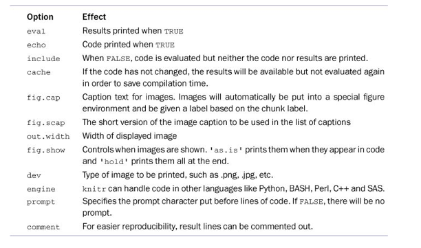


---


## figures in rmarkdown
```{r,eval=F, fig.height=4, fig.width=8}
n <- 100
x <- rnorm(n)
par(mfrow=c(1,2), las=1)
for(i in 1:8) {
  y <- i*x + rnorm(n)
  plot(x, y, main=i)
}
```

---

## figures in rmarkdown

``


---

## figures in rmarkdown
```{r fig.width=5, fig.height=10,eval=FALSE,fig.align='center'}
library(png)
library(grid)
img <- readPNG("figure/format.png")
grid.raster(img)
```

---


## alternative with command
- .Rmd -> .md ->  .pdf/.doc/.html


---

## alternative with command
- .Rmd -> .md ->  .pdf/.doc/.html
- .Rmd -> .md 
```{r,eval=F}
library(knitr)
library(markdown)
##generate .md file
knit("test.Rmd")
## generate .html file
knit("003-minimal.Rhtml")
```

---

## alternative with command
- .Rmd -> .md ->  .pdf/.doc/.html
- .md -> .pdf/.doc/.html
```{r,eval=F}
##generate different format from .md file.
pandoc('test.md', format='html')  # HTML
system("pandoc test.md --latex-engine=xelatex -o test.pdf")
pandoc('test.md', format='docx')  # MS Word

## latex
pandoc('data_analysis.md', format='latex') # LaTeX/PDF
##or
system("pandoc -s test.md -t latex -o test.tex")

## slides
# system("pandoc -s -t slidy test.md -o My_Analysis.html")
system("pandoc -s -t beamer test.md -o My_Analysis.pdf")
```


```{r,eval=F,echo=F}
getwd()
system("pandoc --latex-engine=xelatex data_analysis.md -o output.pdf")
system("pandoc --latex-engine=xelatex -V mainfont='SimSun' data_analysis.md -o output.pdf")
```

---


## slidify

http://slidify.org/start.html

```{r,eval=F}
library(slidify)
author('Qiang')
```

---

## R code in rhtml
```{r,eval=F}
<!--begin.rcode
set.seed(1121)
(x=rnorm(20))
mean(x);var(x)
    end.rcode-->
```

---

## Menu


---


## Framework


---

## Summary
- Literate programming can be powerful to put text, code, data, output all in one document.
- knitr is a powerful tool for integrating code and text in a simple document format.


