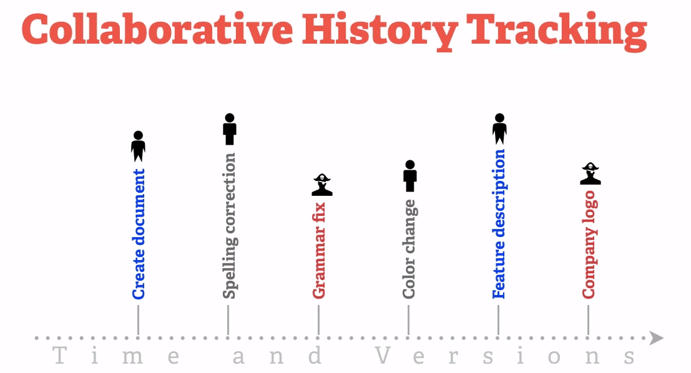

## Start from a real scenario: daily tasks

- **Create** things
- **Save** things
- **Edit** things
- Save the thing **again**

---

## Start from a real scenario

---

## Start from a real scenario

---

## Version control is important!

## Clound storage
- Dropbox
- Nutstore

## Github

## Prerequsites:
- Basic knowledge of R 
- Working knowledge of RStudio 
- Basic knowledge of command shell 
- Curiosity to explore new stuff!

## Software:
- R (stable version 3.2.5) http://cran.r-project.org/ 
- RStudio http://www.rstudio.com/products/rstudio/download/ 
- Git http://git-scm.com/downloads 
- GitHub Acount https://github.com/ 
- a good internet connection!

---

## Step 1:Github
- GitHub Account:https://github.com/ 
- Create Repository Steps for creating a repository: 
1. Repository name 
2. Description (Optional)
3. README
4. Private/Public (Suggested) 

## Step 2: SSH key

- Git/SVN: copy public key
- Github: key dialogue

## Step 3: Git installment

- <https://git-scm.com/>
- Git direcotry: C:\\program and files\\git\\bin\\git\.exe

## configuration in terminal

- git config --global user.email "your email address" 
- git config --global user.name "your user name"
- git config --list
- git push -u origin master`

---

## create project

- create project
- choose version control
- add repository link

## do version control

- commit
- pull and push

